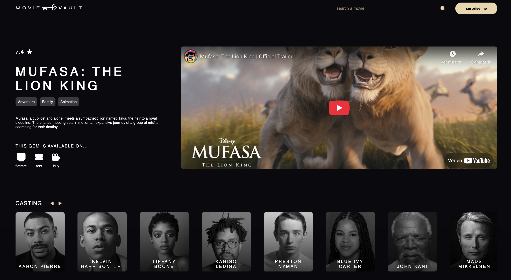

# 🎬 MovieVault (React SPA)

MovieVault es una aplicación web para descubrir películas, ver sus detalles, reparto, plataformas de visualización y trailers. Esta versión está desarrollada con **React** como aplicación de página única (**SPA**) utilizando **React Router** y **Vite** como entorno de desarrollo rápido.

## 🌐 Tecnologías utilizadas

- React
- Vite
- React Router DOM
- CSS Modules + BEM
- TMDb API (The Movie Database)
- YouTube API (fallback para trailers)
- JavaScript moderno
- Responsive design

## ⚙️ Instalación y ejecución

1. **Clona el repositorio:**

```bash
git clone https://github.com/gemadominguez/movievault-spa
cd movievault-spa
```

## 📸 Capturas de pantalla

### Página principal


### Página de detalle



### Página de resultados búsqueda


### Loading al hacer clic al botón "surprise me" (Random Movie)


